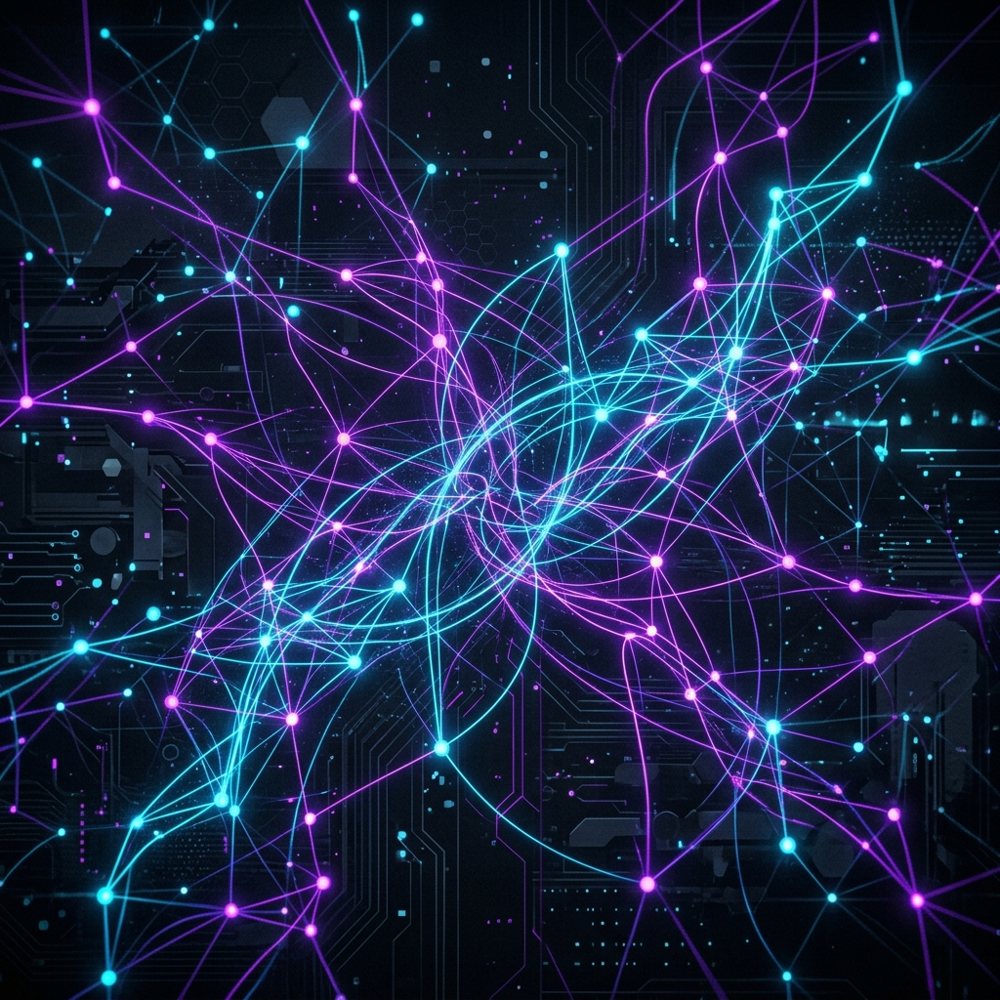
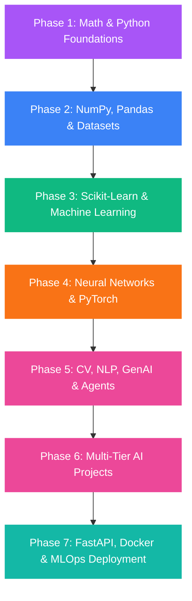

# 🚀 The Complete AI Roadmap (2026)

  
  
  

    <b>Machine Learning, Deep Learning, Generative AI, LLMs, RAG, AI Agents, MLOps, Projects, Deployment, Open Source &amp; Career Guide</b>
  

  <!-- Badges -->
  
  
  
  

---

## 🏆 Why This Roadmap Exists
In 2026, learning Artificial Intelligence can feel overwhelming due to information overload. This repository is built as a **practical, step-by-step, zero-to-advanced guide** mapped with free, high-quality YouTube resources, production code templates, and project tiers. It is designed to help you become an industry-ready AI Engineer, ML Engineer, or Startup Founder.

---

## 🎯 Target Audience
* **Students & Beginners** looking to start from mathematical foundations.
* **Software Developers** wanting to transition into Generative AI and LLMs.
* **Freelancers** who want to offer custom RAG and Agentic solutions to clients.
* **Startup Founders** aiming to build AI SaaS applications.

---

## 📊 Learning Pathway Matrix
Here are the specialized pathways available in this repository:

| Pathway | Focus | Documentation |
| :--- | :--- | :--- |
| **🤖 Machine Learning** | Math foundations, NumPy, Pandas, Scikit-Learn | [View Guide](docs/machine-learning-roadmap.md) |
| **🧠 Deep Learning** | Neural Networks, CNNs, RNNs, PyTorch, Transformers | [View Guide](docs/deep-learning-roadmap.md) |
| **👁️ Computer Vision** | Image Processing, OpenCV, YOLO, Segmentation | [View Guide](docs/computer-vision-roadmap.md) |
| **💬 NLP** | Tokenization, Word Embeddings, BERT, Sequence Tagging | [View Guide](docs/nlp-roadmap.md) |
| **🚀 Generative AI** | Prompting, API Integration, LangChain, LlamaIndex | [View Guide](docs/generative-ai-roadmap.md) |
| **🗂️ RAG Systems** | Chunking, Embeddings, Vector DBs, Hybrid Search | [View Guide](docs/rag-roadmap.md) |
| **🤖 AI Agents** | Autonomous loops, ReAct, CrewAI, LangGraph, MCP | [View Guide](docs/ai-agents-roadmap.md) |
| **⚙️ MLOps & Ops** | Docker, FastAPI, Git, Streamlit, Cloud Hosting | [View Guide](docs/mlops-roadmap.md) |

---

## 🗺️ High-Level Roadmap Flowchart

---

## 📅 The 7-Phase Main Curriculum

### 📌 Phase 1: Math & Python Foundations
*Learn the core languages and logical mathematics that power data transformations.*
* 🐍 **Python Full Course**: [CodeWithHarry Playlist](https://youtube.com/playlist?list=PLu0W_9lII9agICnT8t4iYVSZ3eykIAOME)
* 📐 **Linear Algebra**: [CampusX Playlist](https://youtube.com/playlist?list=PLKnIA16_RmvYu0fS_RuIB2eTbJcTFdrAA)
* 📊 **Statistics for AI**: [CampusX Video Guide](https://youtube.com/watch?v=tPhzDKjQBpo)
* 🎲 **Probability**: [CampusX Video Guide](https://youtube.com/watch?v=Ty7knppVo9E)
* 💻 **Jupyter & Colab Guide**: [Setup Tutorial](https://youtu.be/5pf0_bpNbkw)

### 📌 Phase 2: Data Manipulation & Wrangling
*Master the essential tools for reading, cleaning, and visualizing structured datasets.*
* 🧮 **NumPy Tutorial**: [freeCodeCamp Guide](https://www.youtube.com/watch?v=GB9ByFAIAH4)
* 🐼 **Pandas Full Course**: [CampusX Playlist](https://www.youtube.com/playlist?list=PLKnIA16_RmvbAlyx4_rdtR66B7EHX5k3z)
* 📈 **Matplotlib & Seaborn Visualizations**: [CampusX Playlist](https://www.youtube.com/playlist?list=PLKnIA16_RmvbR85fgbfVRKOiMokUKVupy)

### 📌 Phase 3: Classical Machine Learning
*Understand regression, classification, clustering, and evaluating model metrics.*
* 🤖 **100 Days of Machine Learning**: [CampusX Course](https://www.youtube.com/playlist?list=PLKnIA16_Rmvbr7zKYQuBfsVkjoLcJgxHH)
* 📉 **Feature Engineering & Imputation**: [CampusX Playlist](https://www.youtube.com/playlist?list=PLKnIA16_Rmvbr7zKYQuBfsVkjoLcJgxHH)
* 📊 **StatQuest Machine Learning Videos**: [Concept Explanations](https://youtube.com/playlist?list=PLblh5JKOoLUICTaGLRoHQDuF_7q2GfuJF)
* 🎯 **Evaluation Metrics Tutorial**: [Accuracy, Precision, Recall](https://www.youtube.com/watch?v=4jRBRDbJemM)

### 📌 Phase 4: Deep Learning Foundations
*Build deep neural networks, CNNs, sequence models, and attention mechanisms.*
* 🧠 **Neural Networks Zero to Hero**: [Andrej Karpathy Course](https://www.youtube.com/playlist?list=PLAqhIrjkxbuWI23v9cThsA9GvCAUhRvKZ)
* 🔥 **PyTorch Deep Learning Bootcamp**: [freeCodeCamp Guide](https://youtu.be/V_xro1bcAuA)
* 🛠️ **TensorFlow Developer Course**: [freeCodeCamp Guide](https://youtu.be/tpCFfeUEGs8)
* ⚡ **Transformers from Scratch**: [Karpathy GPT Guide](https://youtu.be/kCc8FmEb1nY)

### 📌 Phase 5: AI Specializations (Generative AI & LLMs)
*Dive into modern state-of-the-art Generative AI architectures, RAG systems, and autonomous agents.*
* 🚀 **Generative AI for Developers**: [Andrew Ng Course Intro](https://youtu.be/mEsleV16qdo)
* 💬 **Intro to Large Language Models**: [Karpathy Guide](https://youtu.be/zjkBMFhNj_g)
* 🤖 **AI Agents & Tool Use**: [ReAct Agent Guide](https://www.youtube.com/watch?v=kBXYFaZ0EN0)
* 🔌 **Model Context Protocol (MCP)**: [MCP Tutorial Guide](https://www.youtube.com/watch?v=3_TN1i3MTEU)
* 🗂️ **Vector Databases & RAG from Scratch**: [Pinecone & LangChain](https://www.youtube.com/playlist?list=PLfaIDFEXuae2LXbO1_PKyVJiQ23ZztA0x)
* 🧪 **PEFT & QLoRA Fine-Tuning**: [Fine-tuning LLMs Guide](https://www.youtube.com/watch?v=J50L7PxA1Qc)

### 📌 Phase 6: Practical Projects Portfolio
*Build real-world systems following our step-by-step guides in [docs/projects-roadmap.md](docs/projects-roadmap.md).*
* 📧 **Spam Classifier**: [Tutorial Guide](https://www.youtube.com/watch?v=YncZ0WwxyzU)
* 🎥 **Recommendation Engine**: [Tutorial Guide](https://youtu.be/V_xro1bcAuA)
* 💬 **AI Customer Chatbot**: [Local Ollama Chatbot](https://www.youtube.com/watch?v=A7EpJzaqtNc)
* 📄 **Resume Skill Analyzer**: [SpaCy NLP Parsing](https://www.youtube.com/watch?v=QBExhbLXlJc)
* 🗂️ **PDF Q&A Assistant**: [RAG Tutorial](https://www.youtube.com/playlist?list=PLfaIDFEXuae2LXbO1_PKyVJiQ23ZztA0x)
* 🎙️ **Voice AI Booking Assistant**: [Multi-Agent Voice Bot](https://www.youtube.com/watch?v=kBXYFaZ0EN0)
* 🌐 **AI Agent Team SaaS**: [CrewAI multi-agent group](https://www.youtube.com/watch?v=kBXYFaZ0EN0)

### 📌 Phase 7: Deployment & MLOps serving
*Ship your models to production and make them available to users worldwide.*
* 🐳 **Docker Containers**: [Docker Crash Course](https://www.youtube.com/watch?v=fqMOX6JJhGo)
* ⚡ **FastAPI APIs**: [FastAPI Tutorial](https://www.youtube.com/watch?v=rvFsGRvj9jo)
* 📊 **Streamlit UI**: [Rapid Dashboard Prototyping](https://youtu.be/vIQQR_yq-8I)
* ☁️ **Deploying to Cloud PaaS**: [Render & Railway Deployment](https://www.youtube.com/watch?v=plcaPeJXeM8)
* ⚙️ **MLOps experiment tracking**: [MLflow Setup](https://www.youtube.com/watch?v=6ngxBkx05Fs)

---

## 📈 Progressive Career Checklists

If you want to tailor your learning towards specific roles, follow these guides:
* 💼 **AI Engineer Path**: Focuses on prompt engineering, LangChain, vector search DBs, and application APIs.
* 🛠️ **ML Engineer Path**: Focuses on feature engineering, model optimization, PyTorch training, and MLOps.
* 📊 **Data Scientist Path**: Focuses on statistics, analytical visualization, and scikit-learn models.
* 🌐 **AI Researcher Path**: Focuses on math, research papers, custom neural network training from scratch.
* 🚀 **Freelancer & Startup Path**: Focuses on Next.js, FastAPI, Stripe payment integration, building SaaS MVPs, and client pricing structures.

---

## 💼 Career Advancement Guides
We have compiled comprehensive materials to help you land interviews, build resumes, and scale freelance businesses:
* 📄 **Resume Writing Guide**: [How to format AI resumes and write XYZ bullet points](docs/resume-guide.md)
* 🎯 **Interview Q&A Prep**: [50+ questions and answers covering ML, DL, and System Design](docs/interview-preparation.md)
* 🎓 **Internship Blueprint**: [Timeline and cold email outreach strategy templates](docs/internship-guide.md)
* 💼 **Freelancing Strategy**: [Upwork guidelines, finding clients, and value-based pricing](docs/freelancing-guide.md)
* 🌐 **Open Source Guide**: [How to make your first Pull Request on LangChain or CrewAI](docs/open-source-guide.md)

---

## 🌟 Progressive Milestones Tracker
Use the checklist below to track your learning journey:

- [ ] **Milestone 1**: Complete Python & Linear Algebra foundations.
- [ ] **Milestone 2**: Build a data wrangling script cleaning a custom CSV with Pandas.
- [ ] **Milestone 3**: Deployed a classification model using Scikit-Learn.
- [ ] **Milestone 4**: Train a custom CNN classifier using PyTorch.
- [ ] **Milestone 5**: Deployed a PDF Question-Answering chatbot (RAG) using Streamlit.
- [ ] **Milestone 6**: Build an autonomous research agent group using CrewAI.
- [ ] **Milestone 7**: Dockerize an API endpoint and deploy to Render cloud.

---

## 👨‍💻 Creator Card

  <table style="border: 2px solid #8a2be2; border-radius: 12px; padding: 15px; background-color: #0d1117;">
    <tr>
      <td align="center">
        <b>Uday Sharma</b> 
        <i>Tech Creator, AI Engineer, and Growth Strategist</i>
          
        
      </td>
    </tr>
    <tr>
      <td>
        <ul>
          <li>🧬 <b>Focus Areas</b>: Generative AI, RAG architecture, and Multi-Agent Loops.</li>
          <li>💼 <b>Freelancing &amp; Consulting</b>: Helping global clients automate workflows with AI Agents.</li>
          <li>🏆 <b>Hackathons</b>: Tech competitor building high-value MVPs in under 48 hours.</li>
          <li>🚀 <b>Mission</b>: Making quality AI education accessible to builders worldwide.</li>
        </ul>
      </td>
    </tr>
  </table>

---

## ⭐ Support the Project
If this repository helps you learn AI or advance your career, please consider giving it a **Star**! Your support keeps this project active and updated with the latest AI technologies.

  

